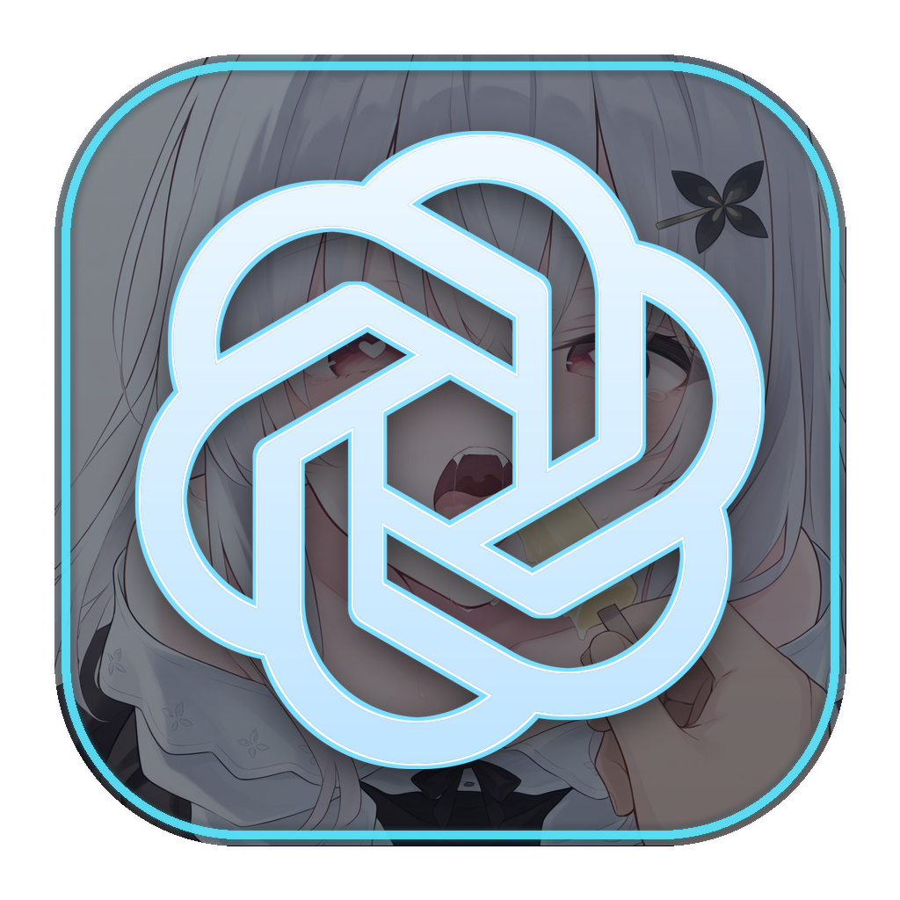

# Codex Background Studio




一个面向 Windows 官方 Codex 桌面应用的独立背景管理器。它通过本机回环
Chromium DevTools Protocol 动态加载背景，不修改 `WindowsApps`、
`app.asar`、应用签名、登录状态或对话数据。

管理器采用 Tauri 2、Rust 和系统 WebView2，不再随安装包捆绑一套 Chromium。

> 非 OpenAI 官方产品。Codex 及相关商标归其权利人所有。

## 功能

- 导入本地图片、视频或整个文件夹
- 下载 HTTP/HTTPS 网络图片和视频并纳入受管媒体库
- 图片覆盖、适应、拉伸和平铺
- 透明度、模糊、缩放、焦点位置、遮罩颜色与强度
- 首页和任务页分别控制显示开关与强度
- 侧栏、内容区不透明度与视频播放设置
- 顺序或随机轮播，自定义切换间隔与播放列表
- 实时预览、热更新、系统托盘、Windows 自启动
- 一键暂停或完整恢复官方外观

支持的图片格式：PNG、JPEG、WebP、GIF、AVIF。

支持的视频容器：MP4、WebM、Ogg Video、QuickTime MOV。视频能否播放还取决于
文件内部编码是否被 Electron/Chromium 支持。

## 开发

要求 Node.js 22 或更高版本、Rust stable、Visual Studio Build Tools 的
“使用 C++ 的桌面开发”工作负载，以及从 Microsoft Store 安装的官方
`OpenAI.Codex` 应用。Windows 10/11 还需 WebView2 Runtime；安装程序会在缺失时
静默下载微软引导器。

```powershell
npm install
npm run check
npm run dev
```

只预览界面：

```powershell
npm run dev:web
```

构建 Windows 安装包：

```powershell
npm run package:win
```

NSIS 产物位于 `src-tauri/target/release/bundle/nsis/`。从 0.4.0 起 Tauri 是唯一
受支持的桌面运行时；旧 Electron 后端仅保留为历史源码，不再构建或维护。

## 发布

推送与应用版本一致的 `v*` 标签会触发 GitHub Actions，在 Windows runner 上执行
完整检查、构建 NSIS 安装包，并创建正式 GitHub Release：

```powershell
git tag v0.4.0
git push origin v0.4.0
```

工作流会核对 `package.json`、`src-tauri/Cargo.toml`、`tauri.conf.json` 和标签版本，
任一不一致都会停止发布。

维护 Codex 页面样式、CDP 注入或媒体流程前，请先阅读项目 Skill：
[`codex-background-development`](./.cursor/skills/codex-background-development/SKILL.md)。
其中记录了各页面入口、稳定选择器、Shadow DOM 处理、调试验证和发布流程。
